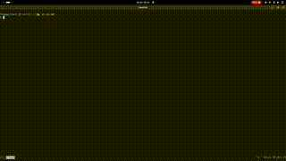

## Installation (Windows, MacOS, Linux)
1. Clone the Repository
```bash
    git clone https://github.com/Addyx18/flappy-bird.git
```
2. Install dependencies:
```bash
    cd flappy-bird
    python3 -m venv venv # Create virtual environment
    source venv/bin/activate  # On Windows use `venv\Scripts\activate`
    pip3 install pygame
```


3. Run the game
```bash
    python3 main.py
```

## Screenshots

### Start Screen


### Game Screen


### End Screen


### Demo



## Contributing
1. Fork the repository
2. Create a new branch: `git checkout -b feature-name`.
3. Make your changes.
4. Push your branch: `git push origin feature-name`.
5. Create a pull request.
